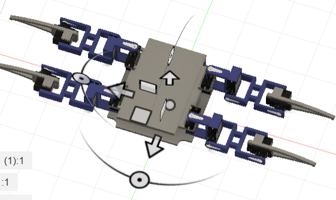

# May 30th: Started Fusion Design
Started on the 3D model of the Spider 
Decided on a quadraped(for now) and designed a 3dof leg 

**Total Time Spent - 7h(i redesigned it 4 times)**

# May 31st: Continued Fusion Design
Changed some stuff with the model, including making it far wider 
Mounted both picam holders for stereoscopic camera 
**Total Time Spent - 1.5h**

# June 1st: Finished Fusion Design
Fixed some dimensions as I had to change my battery voltage for power 
Settled on a Raspi 5, [this](https://robu.in/product/24v-12v-to-5v-5a-power-module-dc-dc-xy-3606-power-converter/) awesome power board(have worked with it before) and the PCA9685 for driving the servos 
Started attempting to derive the equations for IK, as i have no idea what i'm doing when it comes to math 
**Total Time Spent - 3h**

