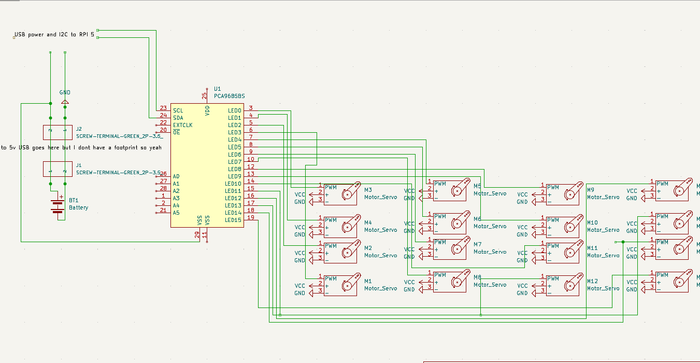
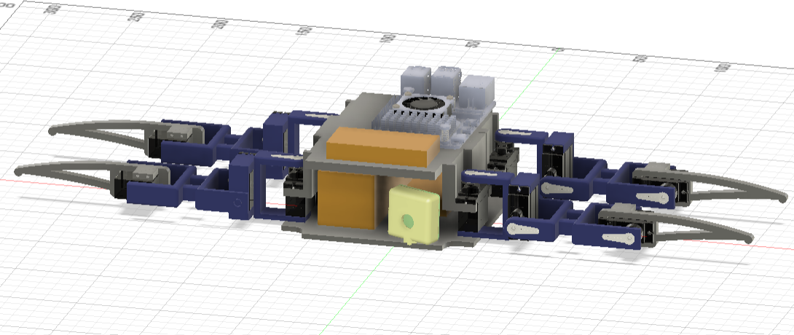

# SPOODERBOT
A fun, 4 legged spider-type robot with capabilities for visual odometry 

This robot was built for the express purpose of learning how to use stereoscopic cameras(and also legged robots) 

This spider uses MG90 type microservoes, which differ from regular(SG90) servoes as they use metal gears(not the crappy plastic ones) 
I intend to use a Raspberry Pi 5, as it has two PiCam ports thru which I can make my stereo camera 

# Why stereo camera?
The reason why I want to use a stereo camera is because it is excellent for VISUAL odometry - while I have messed around with sensor-based odometry, I believe visual odometry is far far better.  
Actual stereo cameras cost far too much, and even cheap ones(like a kinect) are wayy too big for the form factor i'm going for. 
Essentially, I'm trying to do **dynamic** walking with this spider, not some fixed routine like other spider type robots 

# The Design Process

I used Fusion360 to build this robot, as its the CAD software I'm most comfortable with 
This robot did NOT need a PCB, as all i'm using is two different breakout boards(one PCA9685 for servo control and a wonderful 12v to 5v 3A power board for powering the pi and servo board) 

It took me around 10 hours to build the thing in Fusion, the rest of the time was used for software(i'm bad at math) 

# BOM
| ITEM                                                                              | UNIT COST | QTY | TOTAL COST | SOURCE                                                                                                                                                                                                         | NOTES                                                           |
| --------------------------------------------------------------------------------- | --------- | --- | ---------- | -------------------------------------------------------------------------------------------------------------------------------------------------------------------------------------------------------------- | --------------------------------------------------------------- |
| Official Raspberry Pi 5 Cooler                                                    | 5.33$     | 1   | 5.33$      | [https://robu.in/product/official-raspberry-pi-5-active-cooler/](https://robu.in/product/official-raspberry-pi-5-active-cooler/)                                                                               |                                                                 |
| 16-Channel 12-bit PWM/Servo Driver I2C interface PCA9685 for Arduino Raspberry Pi | 2.66$     | 1   | 2.66$      | [https://robu.in/product/16-channel-12-bit-pwmservo-driver-i2c-interface-pca9685-arduino-raspberry-pi/](https://robu.in/product/16-channel-12-bit-pwmservo-driver-i2c-interface-pca9685-arduino-raspberry-pi/) |                                                                 |
| Orange 14.8V 2200mAh 40C 4S Lithium Polymer Battery Pack                          | 22.94$    | 1   | 22.94$     | [https://robu.in/product/orange-2200mah-4s-40c80c-lithium-polymer-battery-pack-lipo/](https://robu.in/product/orange-2200mah-4s-40c80c-lithium-polymer-battery-pack-lipo/)                                     |                                                                 |
| ISDT PD60 60W/6A Portable 1-4s Li-Po Balance Charger                              | 19.62$    | 1   | 19.62$     | [https://robu.in/product/isdt-pd60-60w-6a-portable-1-4s-li-po-balance-charger/](https://robu.in/product/isdt-pd60-60w-6a-portable-1-4s-li-po-balance-charger/)                                                 |                                                                 |
| Raspberry Pi 5 Model 4GB                                                          | 71.86$    | 1   | 71.86$     | [https://robu.in/product/raspberry-pi-5-model-4gb/](https://robu.in/product/raspberry-pi-5-model-4gb/)                                                                                                         |                                                                 |
| Official Raspberry Pi 5 Display FPC Cable 200mm                                   | 1.16$     | 2   | 2.32$      | [https://robu.in/product/official-raspberry-pi-5-display-fpc-cable-200mm/](https://robu.in/product/official-raspberry-pi-5-display-fpc-cable-200mm/)                                                           |                                                                 |
| 5MP Raspberry Pi 3/4 Model B Camera Module Rev 1.3 with Cable                     | 2.71$     | 2   | 5.42$      | [https://robu.in/product/raspberry-pi-camera-module/](https://robu.in/product/raspberry-pi-camera-module/)                                                                                                     |                                                                 |
| MG90S 9g Servo Metal Gear - 180 Degree                                            | 2.76$     | 12  | 11.04$     | [https://robu.in/product/mg90s-9g-servo-metal-gear/](https://robu.in/product/mg90s-9g-servo-metal-gear/)                                                                                                       | Will buy 8 with my own funds, total cost is with hackclub funds |
| SafeConnect XT-60 Male Connector to Banana Connector Charge Adapter Cable         | 1.71$     | 1   | 1.71$      | [https://robu.in/product/charge-cable-w-male-xt60-4mm-banana-plug/](https://robu.in/product/charge-cable-w-male-xt60-4mm-banana-plug/)                                                                         |                                                                 |
|                                                                                   |           |     | 142.9      |                                                                                                                                                                                                                |                                                                 |